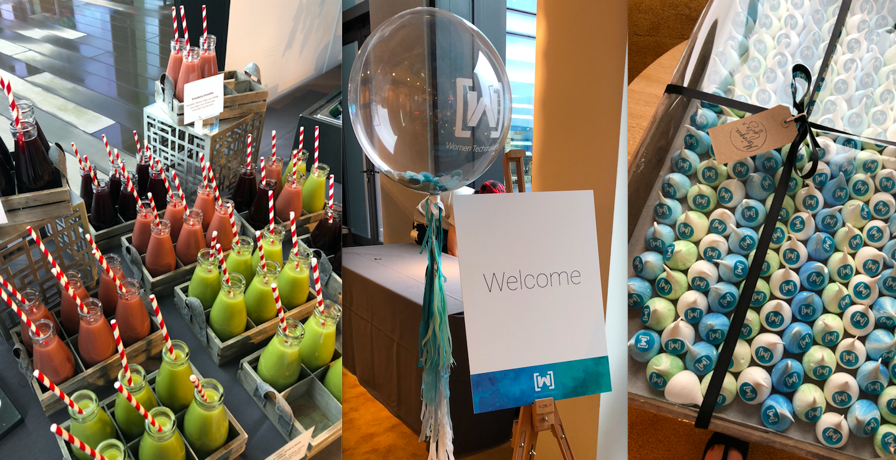
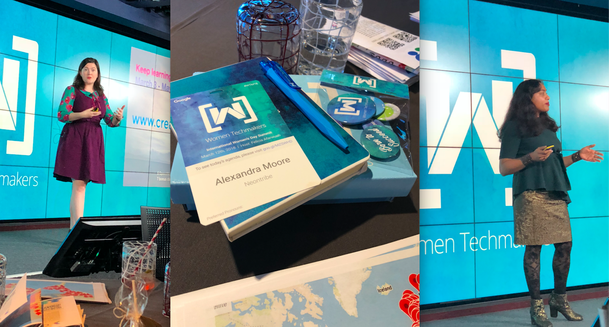
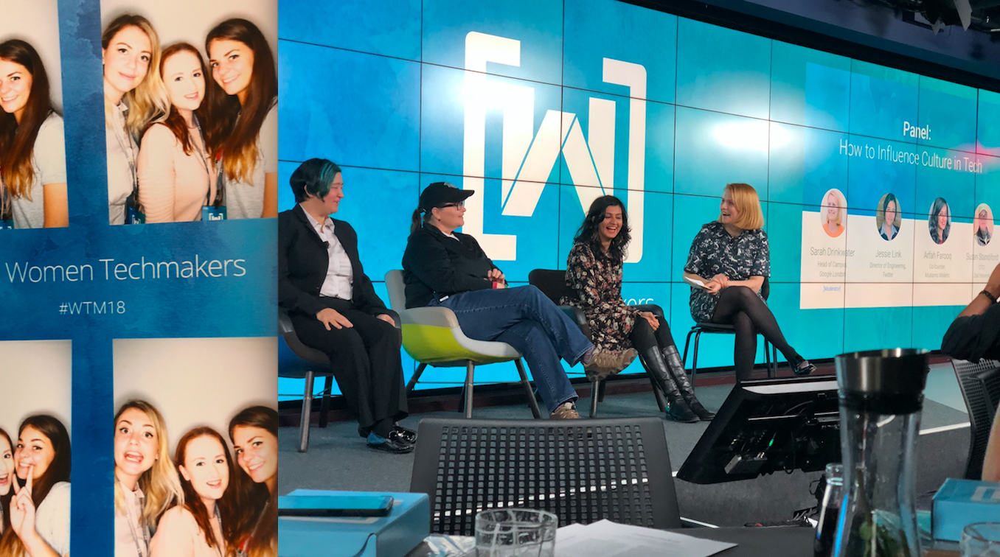

At Neontribe, we often get the opportunity to attend many incredible events across the country. After applying for this summit to celebrate International Women’s Day, I was thrilled to receive an invite to represent Neontribe at this prestigious event.

After arriving at Google’s HQ in London, we were shown into the event space and greeted by a vast selection of colourful smoothies and meringues. We then wandered into a seating area with a goodie-box at each seat! After everybody had sat at my table, we introduced ourselves. I was astounded to discover that I was in the presence of female developers from some really big companies such as The New York Times and The Guardian.

The event then began with [Claire Slattery](https://www.claireslattery.com) giving us a [‘Speechless’ workshop](http://speechlesslive.com/). That not only got us energised for the evening ahead, but also gave helpful tips to improve presentation and communication skills. Radha Narayan then came to the stage, introducing her journey into tech & leadership from humble beginnings being raised in Saudi Arabia. Radha had a strong message that “the real leader in the room is not the one who is always talking, but the one who is listening and making sure everyone is heard” She also mentioned that “people are not just complicated projects”, which resonated with me, as sometimes this personal aspect is far removed from leadership.

[Sarah Drinkwater](https://twitter.com/sarahdrinkwater) then introduced us to her panel of inspiring women in tech: [Jessie Link](https://twitter.com/mad_typist) (Director of Engineering - Twitter), Susan Standiford (COO - Zeal Network) & [Arfah Farooq](https://twitter.com/Arf_22) (Co-Founder - Muslamic Makers). They used their experience in the industry to answer interesting questions about how to influence culture in tech.

A big message to come from them was that a supportive set of leaders within a company makes the biggest difference in encouraging a more diverse workforce. ‘Plans are worthless, but planning is invaluable’ was amongst the valuable takeaways from their Q&A. They recommended tools such as [Impraise](https://www.impraise.com/) and [Office Vibe](https://www.officevibe.com/) to create a constant loop of honest feedback between leaders and their team.

We then had a break and a chance to enjoy the delicious goodies the host had put on for us. As well as the food, we could also enjoy the WTM photobooth and even play rock-paper-scissors against a robotic hand! The event volunteers were also handing out Android Things Starter Kits to each attendee. I have since had a great time putting mine together and experimenting with it.

Finally, we headed back into the room to hear [Ruth John](https://twitter.com/Rumyra) discuss the future of the web as a platform (on the internet’s birthday!). This included not only her audiovisual code pens, showcasing what can be achieved with JS & CSS in interpreting sound to create beautiful visual interfaces, but also the use of WebVR & WebGL to bring virtual reality to web browsers.

All in all it was a great experience and an honour to be in the same room with such inspirational women and it has given me a new energy to really make a positive impact on this industry and encourage other amazing women to do the same.
