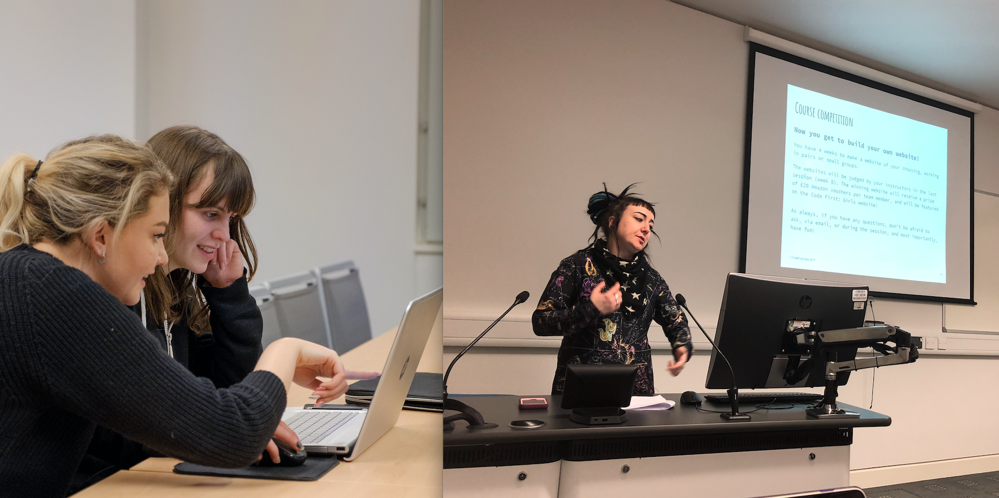

Neontribe strives to support passionate people to get into the industry (see [Untangled](https://www.neontribe.co.uk/the-life-of-a-mentor-untangled-2017/)). So when we were asked to help to run a [Code First: Girls](https://www.codefirstgirls.org.uk) (CF:G) course, we jumped at the chance!

We were approached by [Dr. Pam Mayhew](http://www.uea.ac.uk/computing/people/profile/p-mayhew) from the University of East Anglia (UEA) who asked if we would be interested in helping out, so Kara and I stepped forward from Neontribe as well as Chris and Alice, 3rd Year Computing Science students from the UEA. We decided that Chris and I would be course leads. Now that we had a brilliant team of instructors, we (with the help of Code First: Girls and the UEA) opened applications for the course and advertised it out to all female & non-binary students.

We were slightly anxious that we wouldn’t get enough applicants to make running the course worthwhile, but what came next was completely unexpected. We got an email through from the CF:G programmes manager that we’d had <strong>135</strong> applicants! This was incredible news as it shows the amount of interest in learning to code among women in Norfolk and the potential of reducing the [diversity gap](https://www.brandwatch.com/blog/gender-gap-a-look-at-50-tech) in our industry. However, CF:G usually advise to have 15-30 participants per course so we really had to narrow it down to those who were most passionate about learning to code. After scouring through the applications and finding a larger room to allow us more students, we selected 40 of the most enthusiastic, passionate and committed applicants. Below are some of the reasons why some of the students wanted to take part in the course.

Our first session covered the basics of HTML and we had a wide variety of skill sets among the participants. We made sure to cover everything in depth so that everybody was at the same level moving through the course. This worked quite well as we could give extra support to those who may have needed it. Throughout the rest of the sessions, we were able to teach further aspects of web development including basic design and functionality skills with Javascript and CSS as well as equally important non-programming concepts like User Experience. Some of the toughest lessons for the beginners to learn were the additional libraries to boost their newly acquired skills, [Bootstrap](https://getbootstrap.com/) and [JQuery](https://jquery.com/).

A fantastic thing that this course indirectly encouraged was the importance of teamwork. A few sessions in, CF:G contributed towards a social event for instructors and participants to grab a bite to eat and a drink after the session. This allowed us to all get to know each other better as most of the chosen girls had come from different schools across the university, so may not have come across each other before. Subsequently we encouraged them to form small groups to work together to make a site. This led to the groups meeting outside of the course to develop their websites together and even creating WhatsApp groups to stay in touch.

All in all, leading this course was a wonderful experience and the resulting websites the groups managed to create were spectacular. The winning team ‘A team has no name’ managed to create [this incredible site](https://eerstewart1.github.io/CFG-CourseComp/index.html), with the runners up creating both [an interactive fiction game](https://arurie.github.io/mySite/index.html) and [a site to promote girl gaming in Norwich](https://ghoulpower.github.io/project-recall/site/).

I’m very glad we decided to team up with the UEA as they were able to supply us a great room to use for the sessions and Pam was incredibly helpful and supportive at all stages of the course. I’m also pleased that CF:G were able to provide us such an extensive course, as the course materials covered aspects of web development that are often overlooked when beginning to learn such as Version Control and User Experience.

Finally, I am most grateful for the team of instructors Kara and Alice and my co-lead Chris. They really put their all in volunteering their time to teach the course and support the students in their journey. This has proven to have paid off, as from the feedback we have since received, <strong>95%</strong> of participants said they would continue to code in the future and the average rating of the course was 4.7/5 which is just incredible. Teaching the course and supporting the students was a lot of fun and I’m so glad that the students found the course really worthwhile too.

